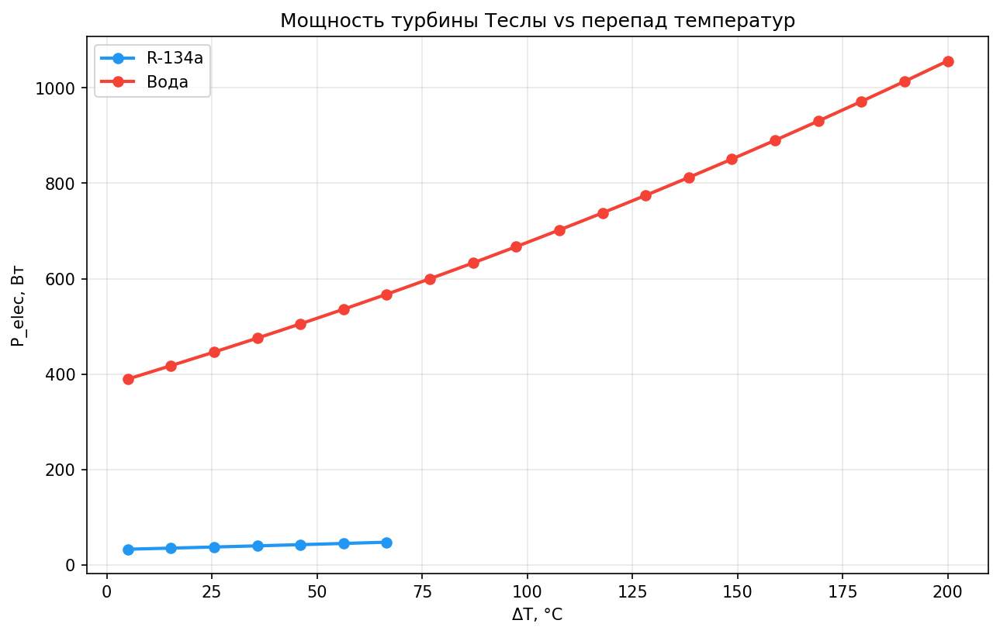
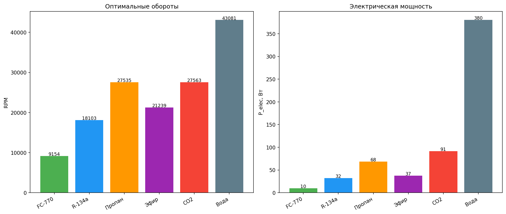

# Турбина Теслы: как получить электричество из отопления, выхлопа и дров

**Турбина без лопаток, без поршней, без взрывов — просто стопка гладких дисков, которая превращает любое тепло в механическую энергию. Разбираем три реальных сценария: когенерация с газовым котлом, утилизация выхлопа автомобиля и автономный дровяной генератор. Все цифры — из матмодели, рыночного анализа и инженерных оценок.**



<cut/>

## 1. Что такое турбина Теслы и почему о ней вспомнили сейчас

Никола Тесла запатентовал свою безлопастную турбину в 1913 году (US 1,061,206). Конструкция поражает минимализмом: стопка гладких дисков на валу, помещённая в герметичный корпус. Всё. Ни лопаток, ни сопел, ни направляющих аппаратов.

Газ входит в корпус по касательной на периферию дискового пакета, закручивается по центростремительной спирали к центру и за счёт вязкого трения в пограничном слое передаёт вращающий момент дискам. Никаких ударов струи о лопатку — поток течёт плавно, как масло между тарелками.

Почему такая простая и элегантная машина не пошла в промышленность? В 1913 году не существовало:

- жаропрочных сплавов (диски при 400°C деформировались);
- точной механики с микронными допусками (зазор между дисками — ключевой параметр);
- дешёвых высокооборотных подшипников на 10 000–20 000 об/мин;
- тяжёлых рабочих тел с молекулярной массой под 400 г/моль.

Сегодня всё это есть. Аддитивные технологии, Inconel и Hastelloy, лазерная резка за копейки, перфторуглероды и органические теплоносители. Момент для возвращения турбины Теслы настал — не как конкурента лопаточным машинам в большой энергетике, а в нишах, где она объективно сильнее: утилизация сбросного тепла, тихая когенерация, off-grid энергоснабжение.

**Принципиальный факт:** турбина Теслы — тепловая машина. Она работает на разности температур. Нет разности — нет работы. Вся математика строится на цикле Ренкина (ORC), и никаких чудес здесь нет. Только инженерия и термодинамика.

---

## 2. Как это работает: диски, пограничный слой и никаких лопаток

Турбина Теслы — машина пограничного слоя. Рабочее тело входит на периферию дискового пакета, попадает в тонкий зазор между дисками и движется к центру по спирали. Из-за условия прилипания (no-slip condition) слой газа у поверхности диска движется с его скоростью, и вязкие силы передают момент от газа к диску.



### Чем турбина Теслы отличается от лопаточной

| Параметр | Лопаточная турбина | Турбина Теслы |
|---|---|---|
| Передача энергии | Удар струи о лопатку | Вязкое трение в пограничном слое |
| Характер потока | Рывками, срыв вихрей | Плавная центростремительная спираль |
| Ударные потери | Значительные | Отсутствуют |
| Чувствительность к каплям и саже | Высокая (эрозия лопаток) | Низкая (капли улучшают сцепление) |
| Влажный пар | Разрушает лопатки | Работает штатно |

Газ сам находит оптимальную траекторию: спираль определяется балансом центробежной силы и вязкого трения. Никаких сложных профилей, никаких расчётов сопловых решёток — правильный зазор между дисками решает всё.

И ключевое преимущество: турбина работает на всём, что течёт. Чистый газ, влажный пар, среда с твёрдыми частицами, капли жидкости — дискам всё равно. Для замкнутого контура рабочее тело циркулирует изолированно, не контактируя с продуктами сгорания.


График выше — зависимость мощности от разности температур для разных рабочих тел. Чем больше ΔT, тем выше мощность. Это обычная термодинамика: тепловая машина тем эффективнее, чем больше перепад температур.

---

## 3. Рабочие тела: что заливать в контур

Выбор рабочего тела — главный рычаг управления. Чем тяжелее молекула — тем ниже оптимальные обороты. Чем выше давление при рабочей температуре — тем больше плотность энергии.

### Сводная таблица

| Рабочее тело | M, г/моль | RPM_опт (D=200 мм) | T_кип, °C | T_крит, °C | Диапазон | Применение |
|---|---|---|---|---|---|---|
| **FC-770** (C₈F₁₈) | 399 | **9 150** | 94,9 | 238,9 | 100–200°C | Когенерация, тихие системы |
| **R-134a** (C₂H₂F₄) | 102 | 18 100 | −26,1 | 101,1 | 30–80°C | Дешёвый прототип |
| **R-245fa** | 134 | ~15 000 | 15,3 | 154,0 | 60–130°C | ORC-системы, рекордный КПД |
| **Даутерм А** | ~170 | ~13 000 | 255 | ~500 | 250–400°C | Высокотемпературная утилизация |

**FC-770** — перфторуглерод с молекулярной массой 399 г/моль. Даёт рекордно низкие для тепловой турбины 9 150 об/мин. Негорюч, стабилен до 400°C, нетоксичен. Минус: дорогой ($50/кг) и при комнатной температуре даёт почти вакуум — контур нужно прогревать перед запуском.

**R-134a** — автомобильный хладагент из любого магазина. Дёшев, доступен, даёт 18 000 об/мин. Идеален для первого прототипа: баллончик $10, характеристики предсказуемы.

**R-245fa** — оптимальное тело для ORC. Именно на нём в 2025 году Li et al. получили рекордный изоэнтропийный КПД 62,28% в лабораторных условиях.

**Даутерм А** (смесь дифенила и дифенилоксида) — для высокотемпературных применений. Работает до 400°C при давлении всего 8–10 атмосфер. Идеален для утилизации тепла выхлопа ДВС.

### Расчётные режимы

| Рабочее тело | T_вход, °C | T_выход, °C | ΔT, K | Давление, атм | RPM (D=200 мм) | Мощность на пакет*, Вт |
|---|---|---|---|---|---|---|
| FC-770 | 100 | 20 | 80 | 1,2 | 10 200 | 60 |
| FC-770 | 150 | 20 | 130 | 4,5 | 10 900 | 72 |
| FC-770 | 200 | 20 | 180 | 12,8 | 11 500 | 86 |
| R-134a | 80 | 30 | 50 | ~12 | 18 100 | 155 |
| Даутерм А | 350 | 80 | 270 | 8–10 | ~13 000 | **2 600** |

*\* Один пакет: D=200 мм, 10 дисков, зазор 0,5 мм. Мощность механическая на валу.*

Цифры скромные для одного пакета. Но масштабирование очевидно: диски штабелируются на один вал, пакеты собираются параллельно. Десять пакетов — десятикратная мощность.

---

## 4. Сценарий первый: газовый котёл как мини-электростанция

У вас есть газовый котёл 24 кВт, греющий дом и горячую воду. Температура подачи — 80°C. Ставим дополнительный пластинчатый теплообменник на подающую линию и ответвляем часть тепла в замкнутый контур турбины Теслы.

### Схема контура

```
Котёл (80°C) → теплообменник → R-245fa (70°C) → турбина → конденсатор (30°C) → обратно в теплообменник
```

Замкнутый контур не касается воды в отоплении. Рабочее тело циркулирует автономно. На входе турбины — 70°C, на выходе — 30°C. Дельта 40 K даёт предел Карно 11,7%.

### Что получаем

| Параметр | Значение |
|---|---|
| Котёл | 24 кВт тепла |
| ΔT на турбине | 40 K |
| Электричество (оценка модели) | **~480 Вт** |
| Часов работы в год (отопительный сезон, РФ) | 5 000+ |
| Годовая выработка | ~2 400 кВт·ч |

### Что питает 480 Вт

- Циркуляционный насос отопления — 50–100 Вт
- Автоматика котла — 20 Вт
- LED-освещение по дому — 50–100 Вт
- Холодильник (среднее потребление) — 100–200 Вт
- Роутер, зарядки — 50 Вт
- **Запас** — ~30–80 Вт

Дом отапливается до 5 000 часов в год, и всё это время турбина крутится. Электричество идёт бесплатно: тепло всё равно уже производится для обогрева. Мы просто перехватываем часть энергии на пути от котла к батареям.

### Масштабирование

| Конфигурация | P_эл | Стоимость | Окупаемость* |
|---|---|---|---|
| 1 пакет D=200 мм, 10 дисков | ~110 Вт | ~$300–500 | ~8–10 лет |
| 3 пакета D=300 мм, 30 дисков | ~480 Вт | ~$600–1 000 | ~5–7 лет |
| 10 пакетов D=300 мм, 100 дисков | ~1 100 Вт | ~$1 500–2 000 | ~5–7 лет |

*\* При тарифе 6 руб/кВт·ч (РФ, 2025).*

Да, солнечные панели окупаются за 3–5 лет с субсидиями. Но турбина работает круглосуточно, не зависит от погоды и даёт полную автономность при отключениях сети: газовый котёл с насосом продолжает работать от своего же тепла. Для регионов с нестабильным электроснабжением это не столько экономия, сколько независимость.

---

## 5. Сценарий второй: электричество из выхлопа автомобиля

ДВС выбрасывает в выхлоп 30–40% энергии топлива. Для легковушки (100 кВт, расход 10 л/100 км) тепловая мощность выхлопа — **30–40 кВт** при температуре 500–700°C. Всё это тепло уходит в атмосферу.

### Схема

Теплообменник на выпускной коллектор → Даутерм А → турбина Теслы → радиатор-конденсатор.

Даутерм А выбран не случайно: стабилен до 400°C, молекулярная масса ~170 г/моль, негорюч, нетоксичен. Давление при 350°C — 8–10 атмосфер — безопасно для автомобильных трубок.

**Параметры контура:**
- Вход турбины: 350°C (запас до 400°C)
- Выход (конденсатор): 80°C
- ΔT = 270 K
- Предел Карно: 1 − 353/623 = **43%**

### Реальная мощность

| Режим | P_эл | Что питает |
|---|---|---|
| Городской цикл | 1,5–2,0 кВт | Генератор + кондиционер |
| Трасса 100–120 км/ч | 2,0–2,6 кВт | Всё бортовое электрооборудование |
| Тяжёлый грузовик (40 т, дизель) | 5–8 кВт | Борт + холодильник + климат |

### Экономия

Бортовой генератор отбирает с коленвала 0,5–1,5 кВт механической мощности через ремень. Турбина на выхлопе даёт те же ватты бесплатно.

**Расчёт для легковушки:**
- 1 кВт отбора с коленвала ≈ 0,2 л/ч дополнительного расхода
- Пробег 40 000 км/год ≈ 2 000 ч работы двигателя
- **Экономия: ~390 л/год** ≈ 40 000 руб (по ценам РФ 2025)

| Параметр | Значение |
|---|---|
| Мощность турбины на выхлопе | 2,6 кВт |
| Заменяет штатный генератор | Да |
| Экономия топлива | ~390–400 л/год |
| Экономия | ~40 000 руб/год |
| Стоимость системы | ~$500–1 000 |
| Окупаемость | **~1–2 года** |

### Почему турбина Теслы, а не турбокомпаунд

Турбокомпаунд (механическая связь выхлопной турбины с коленвалом) используется на Scania, Cummins, Volvo. Но:

| Параметр | Турбокомпаунд | Турбина Теслы (WHR) |
|---|---|---|
| Стоимость | $3 000–10 000 | **$500–1 000** |
| Обороты | 50 000–100 000 RPM | **9 000–18 000 RPM** |
| Редуктор | Планетарный, муфты | **Не требуется** (электрический выход) |
| Чувствительность к саже | Высокая (лопатки) | **Низкая** (гладкие диски) |
| Ресурс | ~10 000 ч | **50 000+ ч** |
| Электричество на борту | Нет (механика → коленвал) | **Да** (прямо в бортовую сеть) |

Разница в цене — в 3–10 раз. Для дальнобойщиков и автопарков окупаемость меньше года.

---

## 6. Сценарий третий: автономный генератор на дровах, газе, пеллетах

### Концепция

Горелка (любая) → теплообменник → турбина Теслы → генератор → 220 В.

Никакого ДВС. Ни поршней, ни клапанов, ни масла, ни свечей зажигания. Просто жжём топливо, греем рабочее тело, крутим диски.

### Тишина

Главное преимущество перед ДВС — уровень шума. Разберём по компонентам:

| Источник шума | Уровень, дБ(A) |
|---|---|
| Подшипники качения (стандартные) | 50–55 |
| Магнитные подшипники (опция) | 35–40 |
| Аэродинамический (гладкие диски, герметичный корпус) | 45–55 |
| Генератор (бесщёточный) | 30–35 |
| **Суммарно (подшипники качения)** | **50–55 дБ** |
| **Суммарно (магнитные подшипники)** | **35–40 дБ** |

50–55 дБ — громче холодильника (~40 дБ), но тише разговора (~60 дБ). На расстоянии 3–5 метров в помещении — едва слышно. Нет лопаточного свиста, нет взрывов в цилиндрах, нет выхлопа. Просто глухой гул, который воспринимается как «нормальный фоновый шум».

### Сравнение шума с конкурентами

| Тип генератора | Шум, дБ | Характер шума |
|---|---|---|
| **Турбина Теслы (подшипники качения)** | 50–55 | Низкочастотный гул |
| **Турбина Теслы (магнитные подшипники)** | 35–40 | Почти неслышно |
| Honda EU2200i (эконом) | 47–55 | Низкий |
| Бензиновый генератор | 70–80 | Рывки, взрывы, выхлоп |
| Дизельный генератор | 65–75 | Стук, вибрация |
| Стирлинг (Qnergy) | 42–48 | Почти тихо |
| Солнечные панели | 0 | Абсолютная тишина |

### Всеядность к топливу

Турбина Теслы — двигатель внешнего сгорания. Камера сгорания не контактирует с дисками, тепло передаётся через теплообменник. Можно сжигать что угодно:

| Топливо | Расход на 1 кВт·ч | Стоимость | Работа в помещении |
|---|---|---|---|
| Природный газ | 0,9 кг/ч (~1,1 м³) | Низкая | ✅ (коаксиал на улицу) |
| Пропан (баллонный) | 1,0 кг/ч | Средняя | ✅ |
| Пеллеты | 2,8 кг/ч | Средняя | ✅ (герметичная) |
| Дрова (сухие) | 3,4 кг/ч | **Низкая / бесплатно** | ⚠️ (только на улице) |
| Биогаз | ~1,0 кг/ч | Низкая | ✅ |

### Пример: дровяная дача

Дача без центрального электричества, есть печь или камин. Ставим медный змеевик в топку → турбина Теслы → 200–500 Вт электричества. Свет (LED), зарядка телефона и ноутбука, насос водоснабжения — всё работает.

Бюджет прототипа: **~$80–150** (5 дисков, труба ПВХ, R-134a, ТЭН для теста). Шум — ниже холодильника. Ресурс — тысячи часов.

---

## 7. Экономика и окупаемость

### Стоимость компонентов (прототип 1 кВт, FC-770, D=350 мм, 30 дисков)

| Компонент | Цена, $ | Примечание |
|---|---|---|
| Диски (30 шт., лазерная резка алюминия, балансировка) | 150 | ~$5/шт, Ø350×1 мм |
| Вал и корпус (сталь/алюминий, токарка) | 100 | |
| Подшипники (2 шт., высокооборотные) | 50 | SKF/NTN 6202-2RS |
| GaIn генератор (магниты + галлий-индий) | 80 | |
| Пластинчатый теплообменник | 80 | SUS316L, ~3 кВт |
| DC-DC преобразователь | 40 | 2,7→48 В, 92% КПД |
| Рабочее тело FC-770 (2 кг) | 100 | $50/кг |
| Арматура, трубки, фитинги | 50 | |
| **Итого прототип** | **~$650** | |
| **Серийная версия (оценка)** | **~$250–400** | |

### Окупаемость в сценарии ГВС

Сценарий: котёл 24 кВт, отопительный сезон 5 000 часов, тариф 6 руб/кВт·ч.

| Система | Стоимость | P_эл | Выработка/год | Экономия/год* | Окупаемость |
|---|---|---|---|---|---|
| 1 пакет D=200 мм | $500 | 110 Вт | 550 кВт·ч | 3 300 руб | ~10 лет |
| 3 пакета D=300 мм | $900 | 480 Вт | 2 400 кВт·ч | 14 400 руб | **~4–5 лет** |
| 10 пакетов D=300 мм | $2 000 | 1 100 Вт | 5 500 кВт·ч | 33 000 руб | **~4–5 лет** |

*\* Без учёта роста тарифов.*

Окупаемость 4–7 лет — отличный показатель для энергооборудования, работающего на сбросном тепле.

---

## 8. Сравнение с конкурентами

| Тип | P, кВт | $/кВт | Шум, дБ | КПД эл. | Ресурс, ч | Топливо |
|---|---|---|---|---|---|---|
| **Турбина Теслы (FC-770)** | 1–5 | 150–650 | 35–55 | 6–8% | 50 000+ | Любое тепло |
| Honda EU2200i | 2,2 | 545 | 48–57 | ~22% | 2 000 | Бензин |
| Стирлинг Qnergy QB-3500 | 3,5 | 2 857 | 42–48 | 22% | 40 000 | Пеллеты/газ |
| Стирлинг WhisperGen | 1,2 | 6 250 | 43–48 | 15% | 10 000+ | Газ |
| Топливный элемент Panasonic Ene-Farm | 1,0 | 17 500 | 42 | 55% | 10 лет | Газ |
| TEG (термоэлектрический) | 0,05–0,4 | 20 000+ | 0 | 5–8% | 50 000+ | Сбросное тепло |
| Micro-ORC Enogia ENO-10 | 10 | 2 500 | ~55 | 10–15% | 50 000+ | Пром. тепло |
| Солнечные панели + АКБ | 1–10 | 1 000–3 000 | 0 | 15–20% | 20+ лет | Солнце |

**Выводы по конкуренции:**
- **Honda:** турбина в 2–3 раза дешевле по системе, в 25 раз дольше ресурс. Проигрыш — в КПД (6–8% против 22%).
- **Стирлинг:** в 4–10 раз дешевле. Стирлинг тише (42–48 дБ), но сложнее, дороже и капризнее.
- **Топливные элементы:** в 30–100 раз дешевле за киловатт. Высокий КПД (55%), но цена космическая.
- **TEG:** турбина в 30+ раз дешевле при том же КПД.
- **Солнечные панели:** дешевеют, но работают только днём. Турбина — круглосуточно.

Турбина Теслы проигрывает по КПД всем, кроме TEG. Но выигрывает по стоимости владения: дешевле купить, дешевле обслуживать, дольше живёт. Для ниш, где на первом месте автономность, ресурс и тишина — это лучший вариант на рынке.

---

## 9. Что дальше: от матмодели к рабочему прототипу

### Открытый репозиторий

Все материалы — математическая модель, чертежи, расчёты, инженерный анализ и обзор рынка — в открытом доступе:

**github.com/pavrlivannikov/tesla-turbine-review**

Это не коммерческий проект. Это инженерная разведка: проверить, стоит ли технология внимания, и дать сообществу готовые к повторению схемы.

### Приоритетные ниши

| Приоритет | Ниша | Почему |
|---|---|---|
| 🥇 | **Когенерация с газовым котлом** | 5 000 ч/год работы, лёгкая интеграция |
| 🥇 | **Утилизация тепла выхлопа ДВС** | 30–40 кВт дармового тепла, окупаемость ~1–2 года |
| 🥈 | **Off-grid дом с дровяным отоплением** | Дрова → тепло + свет, полная независимость |
| 🥈 | **Кемпинг, автокемпинг, яхты** | Тишина, любое топливо, ресурс 50 000+ ч |
| 🥉 | **Резервное питание для дома** | Работа в помещении, нет CO, нет запаха бензина |
| 🥉 | **Автономные метеостанции и телеком-вышки** | Круглосуточная работа от пеллетной горелки |

### План

1. **Собрать прототип за $80–150** — пять дисков, труба ПВХ, R-134a, ТЭН — подтвердить расчёты экспериментально.
2. **Оптимизировать геометрию** — зазор, профиль дисков, шероховатость. Исследования Li et al. (2025) показывают потенциал изоэнтропийного КПД до 62%.
3. **Довести до практической системы** — теплообменник + турбина + генератор + инвертор.
4. **Опубликовать всё** — чтобы любой инженер мог повторить.

### Приглашаю к сотрудничеству

Если вы инженер, теплофизик, механик или просто энтузиаст, которому интересна тема — заходите в репозиторий. Открытые вопросы, в которых нужна помощь:

- Расчёт и оптимизация спирального потока между дисками (CFD-моделирование)
- Выбор и тестирование высокотемпературных рабочих тел
- Конструкция компактного теплообменника для выхлопа ДВС
- Электроника: DC-DC преобразователь для переменного напряжения генератора

Турбина Теслы — не замена лопаточным турбинам в большой энергетике. Это инструмент для тех мест, где тепло есть, а электричества нет. Где нужна тишина и не нужен бензин. Где важнее ресурс, а не рекордный КПД.

**И для этих мест — это лучший вариант на рынке.**

---

*Статья подготовлена на основе математической модели, инженерного анализа и обзора рынка. Проект «Турбина Теслы — замкнутый контур, тепловая машина, униполярный генератор», май 2026.*

*Репозиторий: [github.com/pavrlivannikov/tesla-turbine-review](https://github.com/pavrlivannikov/tesla-turbine-review)*

---

<!-- Теги: физика, энергетика, инженерия, ORC, Тесла -->
