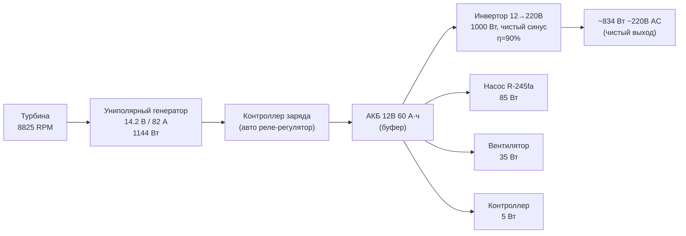

# Турбина Теслы для газового котла — ФИНАЛЬНАЯ архитектура

**Дата:** 2026-05-31
**Версия документа:** 2.0 (финальная)
**Статус:** Инженерная спецификация, предпрототип

---

## 0. Исполнительное резюме

**Продукт:** ORC-генератор на турбине Теслы с **униполярным генератором** (фича Теслы!), утилизирующий сбросное тепло газового котла отопления.

**Ключевые параметры:**

| Параметр | Значение |
|---|---|
| Мощность электрическая (номинальная, DC) | 1144 Вт |
| Чистый выход за вычетом собственных нужд | 1019 Вт DC |
| Чистый выход после инвертора (220В AC) | **834 Вт** |
| Мощность тепловая (отбор от котла) | ~12 кВт |
| Диаметр дисков | 350 мм |
| Число дисков | 20 (2 пакета по 10) |
| Обороты | 8825 RPM |
| Генератор | **Униполярный** (GaIn жидкометаллический токосъём) |
| Электрика | ВСЁ АВТОМОБИЛЬНОЕ (12В), без DC-DC! |
| Рабочее тело | R-245fa |
| Уровень шума | ≤45 дБ |
| Ресурс | 50 000+ ч |
| Габариты корпуса | 410×410×106 мм |
| Стоимость DIY Kit | **~58 000 ₽ (~$640)** |
| Окупаемость DIY | **~4 года** |
| Годовая экономия | ~15 000 ₽/год (1500–2500 кВт·ч) |

**УТП:** Диски крутятся = диски генерируют ток. Униполярный генератор — фича самого Теслы. Всё электричество — стандартное автомобильное 12В. Никакой экзотики. Подключается к любому газовому котлу 24 кВт.

---

## 1. Термодинамический цикл

### 1.1. Граничные условия

| Параметр | Значение |
|---|---|
| Температура испарителя (R-245fa после ТО) | 65°C |
| Температура конденсатора (уличный воздух) | 25°C |
| Разность температур ΔT | 40 K |
| Давление на входе турбины (P_вход) | 5.1 бар (65°C) |
| Давление на выходе турбины (P_выход) | 1.5 бар (25°C) |
| Рабочее тело | R-245fa (T_кип=15°C при 1 атм) |

### 1.2. R-245fa — свойства рабочего тела

| Свойство | Значение |
|---|---|
| Химическая формула | CF₃CH₂CHF₂ (1,1,1,3,3-пентафторпропан) |
| Молярная масса M | 134.05 г/моль |
| T кипения (1 атм) | 15.3°C |
| T критическая | 154.0°C |
| P критическая | 36.4 атм |
| Удельная теплота парообразования | 196 кДж/кг |
| Показатель адиабаты γ | 1.10 |
| ODP (озоноразрушающий потенциал) | 0 |
| GWP (потенциал глобального потепления) | 858 |
| Класс безопасности (ASHRAE) | B1 (негорюч) |

### 1.3. Рабочие точки цикла

**Номинальный режим:** T_исп = 65°C, T_конд = 25°C

| Точка цикла | T, °C | P, бар | Фаза | Описание |
|---|---|---|---|---|
| 1 → 2 | 65 → 65 | 5.1 → 5.1 | Насыщ. пар | Вход турбины |
| 2 → 3 | 65 → ~28 | 5.1 → 1.5 | Перегретый пар → влажный | Расширение в турбине |
| 3 → 4 | 28 → 25 | 1.5 → 1.5 | Влажный пар → жидкость | Конденсация |
| 4 → 5 | 25 → 25 | 1.5 → 5.1 | Жидкость | Насос (повышение давления) |
| 5 → 1 | 25 → 65 | 5.1 → 5.1 | Жидкость → пар | Испаритель (котёл) |

### 1.4. КПД и мощности

| Параметр | Формула / источник | Значение |
|---|---|---|
| КПД Карно | 1 − T_конд / T_исп = 1 − 298/338 | **11.7%** |
| Реальный КПД цикла (ORC micro) | η_Карно × 0.50…0.55 | **~6%** |
| Механическая мощность турбины | P_mech (расчётная) | **1157 Вт** |
| КПД униполярного генератора | η_ген | **99%** |
| Электрическая мощность брутто | 1157 × 0.99 | **1144 Вт** |
| Собственные нужды | Насос (85) + вентилятор (35) + контроллер (5) | **125 Вт** |
| Чистая мощность DC | 1144 − 125 | **1019 Вт** |
| Чистая мощность AC (после инвертора 90%) | 1019 × 0.90 | **834 Вт** |

### 1.5. Тепловой баланс системы

```
Котёл (24 кВт, η=90% → 21.6 кВт тепла)
  │
  ├── ~12 кВт → Испаритель (пластинчатый ТО, 12 кВт)
  │                │
  │                ├── 1.157 кВт → механическая работа турбины (8825 RPM)
  │                │                  │
  │                │                  ├── 1.144 кВт → электричество (генератор 99%)
  │                │                  │                  │
  │                │                  │                  ├── 0.085 кВт → насос R-245fa
  │                │                  │                  ├── 0.035 кВт → вентилятор
  │                │                  │                  ├── 0.005 кВт → контроллер
  │                │                  │                  │
  │                │                  │                  └── 1.019 кВт → DC шина 14.2В
  │                │                  │                                    │
  │                │                  │                                    └──→ инвертор (90%)
  │                │                  │                                          ↓
  │                │                  │                                    834 Вт ~220В AC
  │                │                  │
  │                │                  └── 0.011 кВт → потери генератора
  │                │
  │                └── ~10.8 кВт → в конденсатор (отработанный пар)
  │                                 │
  │                                 ├── сброс в атмосферу (радиатор + вентилятор)
  │                                 └── 0.085 кВт → насос R-245fa (мех. работа)
  │
  └── ~9.6 кВт → в систему отопления дома (≈44% тепла котла)
```

---

## 2. Геометрия турбины

### 2.1. Дисковый пакет

| Параметр | Значение | Обоснование |
|---|---|---|
| **Диаметр дисков D** | **350 мм** | Оптимум мощность/обороты для 1144 Вт |
| Количество дисков | 20 | **2 пакета по 10 дисков** |
| Зазор между дисками g | 0.3 мм | Оптимум по трению / массопереносу |
| Толщина диска t | 1.0 мм | Алюминий |
| Материал дисков | Алюминий (АМг6) | Лёгкий, коррозионностойкий |
| **Обороты** | **8825 RPM** | Расчётная скорость для D=350 мм |
| Расположение магнитов | **Между пакетами** | Последовательное соединение пакетов через магниты N52 |
| Соединение пакетов | **Последовательное** | Через магниты N52 — создаёт напряжение 14.2 В |

### 2.2. Кинематические параметры

| Параметр | Значение |
|---|---|
| Угловая скорость ω | 924 рад/с (8825 RPM) |
| Линейная скорость на периферии | ~162 м/с |
| Относительная скорость пар-диск | ~90 м/с |
| Крутящий момент | ~1.25 Н·м (1157 Вт / 924 рад/с) |

### 2.3. Размеры корпуса

| Размер | Значение |
|---|---|
| Габариты корпуса | **410 × 410 × 106 мм** |
| Материал корпуса | Алюминий (токарная обработка) |

---

## 3. Униполярный генератор и электрическая часть

### 3.1. Униполярный генератор (диск Фарадея — фича Теслы!)

**Это ключевая особенность проекта.** В отличие от обычных генераторов, **сами диски турбины являются ротором униполярного генератора**. Магниты размещены между двумя пакетами дисков, создавая магнитное поле B=0.5 Тл.

**Принцип:** Диски турбины вращаются в магнитном поле → на радиусах дисков наводится ЭДС → ток снимается жидкометаллическим GaIn токосъёмом.

| Параметр | Значение |
|---|---|
| Тип генератора | **Униполярный (диск Фарадея)** |
| Магниты | **N52**, кольцевые, между пакетами дисков |
| Индукция B | **0.5 Тл** |
| Токосъём | **GaIn (жидкометаллический сплав)**, R_brush = 0.005 Ом |
| Соединение пакетов | **Последовательное** через магниты |
| **Напряжение U** | **14.2 В** (2 пакета последовательно) |
| **Ток I** | **82 А** |
| **Электрическая мощность P_elec** | **1144 Вт** (14.2 В × 82 А × 0.98 коэфф. формы) |
| **КПД генератора η_ген** | **99%** (минимальные потери — GaIn токосъём) |

### 3.2. Электрическая часть — ВСЁ СТАНДАРТНОЕ АВТОМОБИЛЬНОЕ!

**Это второе ключевое УТП.** Благодаря напряжению 14.2 В (стандартное автомобильное), вся электрическая обвязка — из обычного автомагазина. **Никакого DC-DC преобразователя не нужно!**

| Компонент | Тип | Цена | Где купить |
|---|---|---|---|
| **Генератор** | Униполярный, 14.2 В, встроен в турбину | — | В комплекте |
| **Контроллер заряда** | Стандартный автомобильный реле-регулятор | 1000 ₽ | Любой автомагазин |
| **АКБ** | Свинцово-кислотный 12В, **60 А·ч** | 3000 ₽ | Любой автомагазин |
| **Инвертор** | Автомобильный 12→220В, **чистый синус, 1000 Вт** | 4000 ₽ | Любой автомагазин / маркетплейс |
| Проводка | Стандартная автомобильная (ПВА 6–16 мм²) | — | Любой автомагазин |

### 3.3. Баланс мощностей (электрика)



### 3.4. Распределение чистой мощности (834 Вт 220В)

| Потребитель | Мощность, Вт |
|---|---|
| LED-освещение (5 ламп) | 50 |
| Холодильник А++ | 150 |
| Роутер + камеры | 30 |
| Циркуляционный насос отопления | 60 |
| Телевизор | 100 |
| Зарядки (телефоны, ноутбук) | 30 |
| **Запас** | **~414 Вт** (можно ноутбук, доп. обогреватель, зарядка электроинструмента) |
| **Итого** | **834 Вт** |

---

## 4. Система теплообмена

### 4.1. Испаритель (горячий контур: котловая вода → R-245fa)

| Параметр | Значение |
|---|---|
| Тип | Пластинчатый, паяный SUS316L |
| Тепловая мощность | **12 кВт** |
| Сторона 1: котловая вода | 70/80°C → 55/60°C |
| Сторона 2: R-245fa | 25°C (жидк.) → 65°C (пар) |
| Подключение | В разрыв системы отопления |

### 4.2. Конденсатор (холодный контур: R-245fa → уличный воздух)

| Параметр | Значение |
|---|---|
| Тип | Автомобильный радиатор + вентилятор |
| Тепловая мощность | ~10.8 кВт |
| Охлаждение | Уличный воздух (25°C номинал) |
| Температура конденсации | ~25°C |

### 4.3. Насос R-245fa

| Параметр | Значение |
|---|---|
| Тип | Мембранный, химстойкий |
| Давление на входе | 1.5 бар |
| Давление на выходе | 5.1 бар |
| Перепад давления | 3.6 бар |
| **Потребляемая мощность** | **85 Вт** (12В DC) |

### 4.4. Собственные нужды (суммарно)

| Потребитель | Мощность, Вт | Напряжение |
|---|---|---|
| Насос R-245fa | 85 | 12В DC |
| Вентилятор конденсатора | 35 | 12В DC |
| Контроллер (ESP32 + датчики) | 5 | 5/3.3В |
| **Итого** | **125 Вт** | — |

---

## 5. Стоимость (BOM — DIY Kit)

**Все цены в рублях (2026). Курс: ~90 ₽/$**

| № | Позиция | Кол-во | Цена, ₽ |
|---|---|---|---|
| **1. Турбина** | | | |
| 1.1 | Диски алюминиевые (лазерная резка Al 350 мм) | 20 шт | 8 000 |
| 1.2 | Вал + подшипники керамические | 1 компл. | 5 000 |
| 1.3 | Корпус алюминиевый (410×410×106 мм, токарка) | 1 | 6 000 |
| | *Итого турбина* | | **19 000** |
| **2. Генератор** | | | |
| 2.1 | Магниты N52 (кольцевые, для установки между пакетами) | 2+ | 4 000 |
| 2.2 | GaIn сплав (жидкометаллический токосъём, 20 г) | 20 г | 3 000 |
| | *Итого генератор* | | **7 000** |
| **3. Теплообмен** | | | |
| 3.1 | Пластинчатый теплообменник 12 кВт | 1 | 6 000 |
| 3.2 | Конденсатор (автомобильный радиатор + вентилятор) | 1 компл. | 3 000 |
| 3.3 | Насос мембранный R-245fa | 1 | 7 000 |
| 3.4 | R-245fa (2 кг) | 2 кг | 4 000 |
| | *Итого теплообмен* | | **20 000** |
| **4. Электрика (стандартная автомобильная)** | | | |
| 4.1 | АКБ автомобильный 12В 60 А·ч | 1 | 3 000 |
| 4.2 | Инвертор 12→220В, 1000 Вт, чистый синус | 1 | 4 000 |
| 4.3 | Контроллер заряда (авто реле-регулятор) | 1 | 1 000 |
| | *Итого электрика* | | **8 000** |
| **5. Гидравлика** | | | |
| 5.1 | Трубки медные, фитинги, клапаны | 1 компл. | 4 000 |
| | *Итого гидравлика* | | **4 000** |
| | | | |
| | **ИТОГО DIY Kit** | | **~58 000 ₽** |
| | **ИТОГО в USD** | | **~$640** |

---

## 6. Сравнение с конкурентами

| Параметр | **Турбина Теслы (DIY)** | Бензогенератор Honda EU2200i | Солнечные панели 1 кВт + АКБ | TEG на котле |
|---|---|---|---|---|
| **Цена** | **$640** (DIY) | $1 199 | $1 500–2 000 | $500–2 000 |
| **Мощность** | **834 Вт AC** | 1800 Вт AC | 1000 Вт (пик) | 10–100 Вт |
| **Топливо** | От тепла котла (бесплатно) | Бензин | Солнце (бесплатно) | От тепла (бесплатно) |
| **Шум** | **~45 дБ** (тихо) | 48–57 дБ | 0 дБ | 0 дБ |
| **Работа круглосуточно** | ✅ Да (пока котел греет) | ✅ Да | ❌ Только днём | ✅ Да |
| **Работа зимой** | ✅ Да (пик!) | ✅ Да | ❌ (мало света) | ✅ Да |
| **Ресурс** | **50 000+ ч** | ~2 000 ч | 25–30 лет | 50 000+ ч |
| **Обслуживание** | Раз в 5 лет | Каждые 50–100 ч | Чистка 2 р/год | Нет |
| **Требует топлива** | ❌ Нет | ✅ Да (бензин) | ❌ Нет | ❌ Нет |
| **CO / выхлоп** | ❌ Нет | ✅ Да (опасно в помещении) | ❌ Нет | ❌ Нет |

### 6.1. Окупаемость

| Параметр | Значение |
|---|---|
| Чистый выход | 834 Вт AC |
| Работа в год | 5 000 ч (отопительный сезон) |
| Годовая генерация | **1 500–2 500 кВт·ч** |
| Экономия в год | **~15 000 ₽/год** |
| Стоимость DIY | 58 000 ₽ |
| **Окупаемость DIY** | **~4 года** |

---

## 7. Краудфандинг

### 7.1. УТП (Уникальное торговое предложение)

- **Диски крутятся = диски генерируют ток** (униполярный генератор — фича самого Теслы!)
- **14.2 В → стандартный автомобильный АКБ** (никакой экзотики, всё из автомагазина)
- **Работает 5 000 ч/год**, пока дом греется
- **Экономия ~15 000 ₽/год**
- **Окупаемость DIY: 4 года**

### 7.2. Текст кампании (кратко)

**Заголовок:** «Турбина Теслы для дома: 834 Вт электричества от вашего котла»

**Лид:** Каждый отопительный сезон ваш газовый котел сжигает газ и греет дом — а вы всё равно платите за электричество. Что если бы часть этого тепла превращалась в бесплатное электричество — 24/7, без шума, без топлива, без сложной электроники?

**Проблема:** Владельцы частных домов платят 30–60 тыс. ₽/год за электричество. Солнечные панели зимой бесполезны. Бензогенераторы шумные, дорогие в эксплуатации и требуют обслуживания каждые 50 часов.

**Решение:** Турбина Теслы — безлопастная турбина, в которой газ R-245fa, нагретый от котла до 65°C, раскручивает стопку алюминиевых дисков. Сами диски одновременно служат ротором **униполярного генератора** — фича Теслы, которую он запатентовал ещё в XIX веке, но никто не довёл до коммерческого продукта.

**Как работает:**
1. Котёл греет дом → тепло идёт в теплообменник
2. R-245fa испаряется (65°C, 5 бар) → раскручивает диски (8825 RPM)
3. Между пакетами дисков — магниты N52 → диски генерируют 14.2 В
4. GaIn жидкометаллический токосъём снимает ток — 82 А, 1144 Вт
5. 14.2 В → прямо на автомобильный АКБ → инвертор → 220 В
6. Всё стандартное, всё из автомагазина

**TTX:** 834 Вт чистого выхода 220В, 45 дБ, ресурс 50 000+ часов.

**Награды (уровни):**

| Уровень | Взнос, ₽ | Вознаграждение |
|---|---|---|
| Спасибо | 3 000 | Наклейка + открытка с чертежом турбины |
| Early Bird Kit | 30 000 | DIY Kit (~50% от цены) |
| Стандартный DIY | 58 000 | Полный DIY Kit |
| Plug & Play | 90 000 | Собранный и настроенный комплект |
| С установкой | 130 000 | Plug & Play + монтаж + пусконаладка |
| Инвестор | 150 000 | Plug & Play + именной блок + участие в следующей версии |

**Команда:** [Павел К. — инженер-конструктор, теплоэнергетика / газоснабжение, 15+ лет]

**Roadmap:**
- Прототип — Q3 2026
- Испытания — Q4 2026
- Краудфандинг — Q1 2027
- Поставка первых комплектов — Q2–Q3 2027

---

## 8. Риски

| Риск | Вероятность | Влияние | Митигация |
|---|---|---|---|
| GaIn токосъём — технологическая сложность | Средняя | Высокое | Альтернатива: медные щётки (но КПД ниже) |
| КПД цикла ниже расчётного | Средняя | Среднее | Консервативная оценка 6% — есть запас |
| Утечка R-245fa | Низкая | Среднее | Все соединения под обжим, предохранительный клапан |
| Шум вентилятора ночью | Низкая | Низкое | PWM управление, режим «тихо» |
| Дефицит R-245fa в РФ/СНГ | Средняя | Высокое | Альтернатива: R-134a (но выше давление) |
| Нет спроса на краудфандинге | Средняя | Критическое | Аудитория — владельцы частных домов с газом |

---

## 9. Roadmap

**Этап 1: Концепт (Q2 2026)**
- [x] Математическая модель термодинамического цикла
- [x] Выбор диаметра и числа дисков (350 мм, 2×10)
- [x] Выбор униполярного генератора как ключевой фичи
- [x] BOM — отказ от DC-DC, всё автомобильное
- [ ] CFD-моделирование дискового пакета (OpenFOAM)
- [ ] FEM-анализ дисков на 8825 RPM

**Этап 2: Прототип (Q3 2026)**
- [ ] Изготовление дисков (лазерная резка Al 350 мм)
- [ ] Изготовление корпуса (410×410×106 мм)
- [ ] Магниты N52 — установка между пакетами
- [ ] GaIn токосъём — сборка и тест
- [ ] Пневмо-испытания (воздух, 2 атм)
- [ ] Гидро-испытания (R-245fa, холодный контур)

**Этап 3: Испытания (Q4 2026)**
- [ ] Заправка R-245fa, пуск
- [ ] Подключение к котлу-стенду
- [ ] Измерение P_эл, RPM, КПД
- [ ] Измерение шума
- [ ] Недельные непрерывные испытания
- [ ] Оптимизация GaIn токосъёма

**Этап 4: Предпроизводство (Q1 2027)**
- [ ] Чертежи и документация
- [ ] Поиск поставщиков (лазерная резка, токарка, магниты)
- [ ] 3 опытных образца, 100 ч непрерывных испытаний
- [ ] Испытания на разных котлах
- [ ] Инструкция по сборке

**Этап 5: Краудфандинг (Q1–Q2 2027)**
- [ ] Kickstarter / Boomstarter
- [ ] Первая партия 50 шт
- [ ] Поставка backer'ам через 4–6 месяцев

**Этап 6: Серия (Q3–Q4 2027)**
- [ ] Мелкосерийное производство (10–50 шт/мес)
- [ ] Сертификация
- [ ] Дилерская сеть (РФ, СНГ)

---

*Документ составлен на основе финальной архитектуры проекта (v2.0).*
*Дата: 2026-05-31*
*Ключевые отличия от v1.0: D=350 мм (было 250 мм), 2 пакета по 10 дисков (был 1 пакет 20), униполярный генератор GaIn (был AFPM), всё автомобильное 12В без DC-DC (был 24В с DC-DC и LiFePO4), выход 834 Вт (было ~340 Вт).*
